# go-proxy-bing

基于微软 New Bing 用 Vue3 和 Go 简单定制的微软 New Bing 演示站点，拥有一致的 UI 体验，支持 ChatGPT 提示词，国内可用，基本兼容微软 Bing AI 所有功能，无需登录即可畅聊。

⭐ Bing 官方聊天服务器（相对较快和稳定，推荐）不可用时，可参考以下方案

  > 1. 可用 ModHeader 添加 X-Forwarded-For 请求头，对应 URL 是 wss://sydney.bing.com/sydney/ChatHub，具体可参考 [issues #71](https://github.com/adams549659584/go-proxy-bingai/issues/71) 及 https://zhuanlan.zhihu.com/p/606655303

  > 2. 本地部署再部署一份作为聊天中转服务，或下载 Release 直接运行，自定义聊天服务器中填入 http://localhost:8080，并选择。

⭐ 聊天服务器 (暂时默认 Cloudflare Workers，请求数每天限额 100,000，撑不了多久 ，推荐自行部署，参考下面 [部署聊天服务器](#部署聊天服务器) ) 可在右上角 设置 => 服务选择 中切换

⭐ 国内可用 （部署服务器需要直连 www.bing.com 不重定向 CN ，可配置 socks 连接）

⭐ 支持现有开源 ChatGPT 提示词库

⭐ 需要画图等高级功能时(需选更有创造力模式或右上角 设置 => 图像创建 )，可登录微软账号设置用户 Cookie 进行体验

⭐ 遇到一切问题，先点左下角  试试，不行使用刷新大法（Shift + F5 或 Ctrl + Shift + R 或 右上角设置中的一键重置），最终大招就 清理浏览器缓存 及 Cookie ，比如（24 小时限制、未登录提示等等）

- [go-proxy-bing](#go-proxy-bing)
  - [网页展示](#网页展示)
  - [侧边栏](#侧边栏)
  - [演示站点](#演示站点)
  - [设置用户](#设置用户)
  - [环境变量](#环境变量)
  - [部署](#部署)
    - [Docker](#Docker)
    - [Release](#Release)
    - [Railway](#Railway)
    - [Vercel](#Vercel)
    - [Render](#Render)
  - [部署聊天服务器](#部署聊天服务器)
  - [TODO](#TODO)

## 网页展示

- 电脑端未登录状态

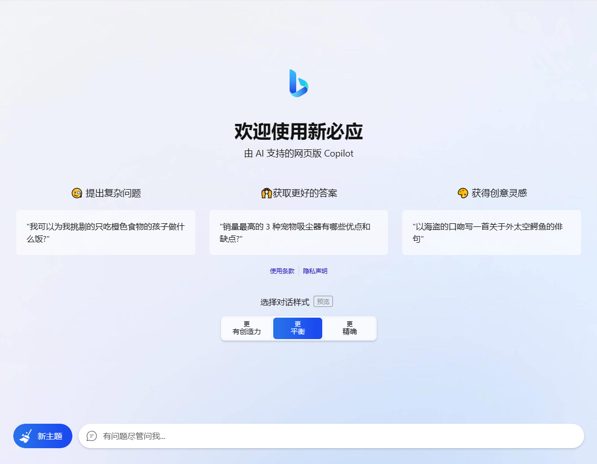

- 电脑端登录

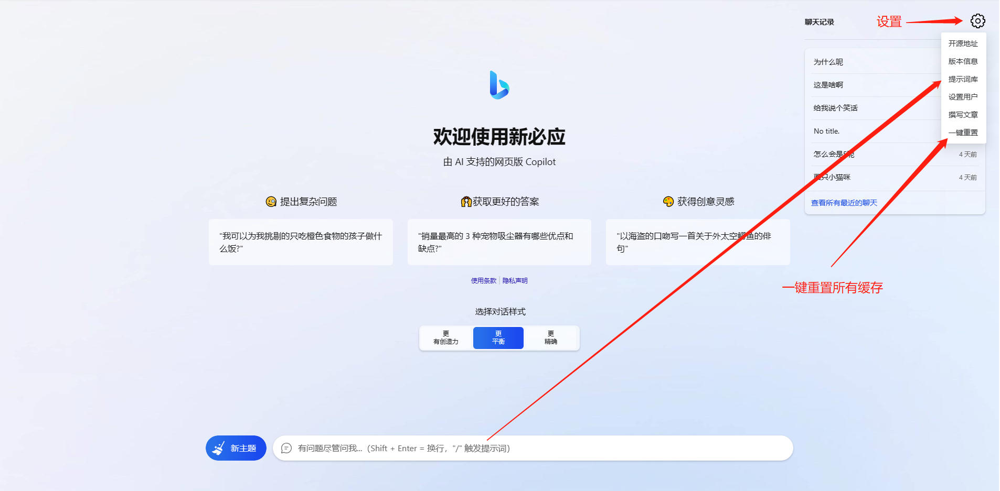
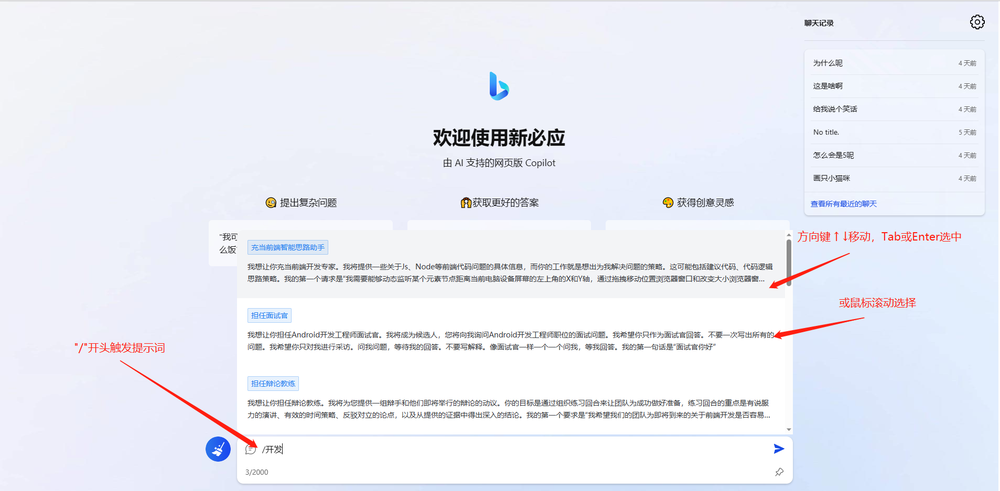
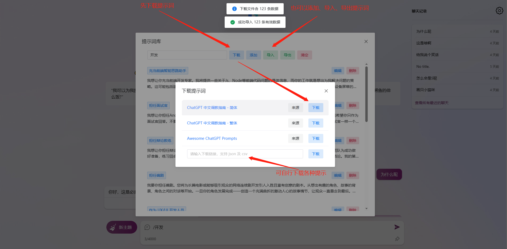
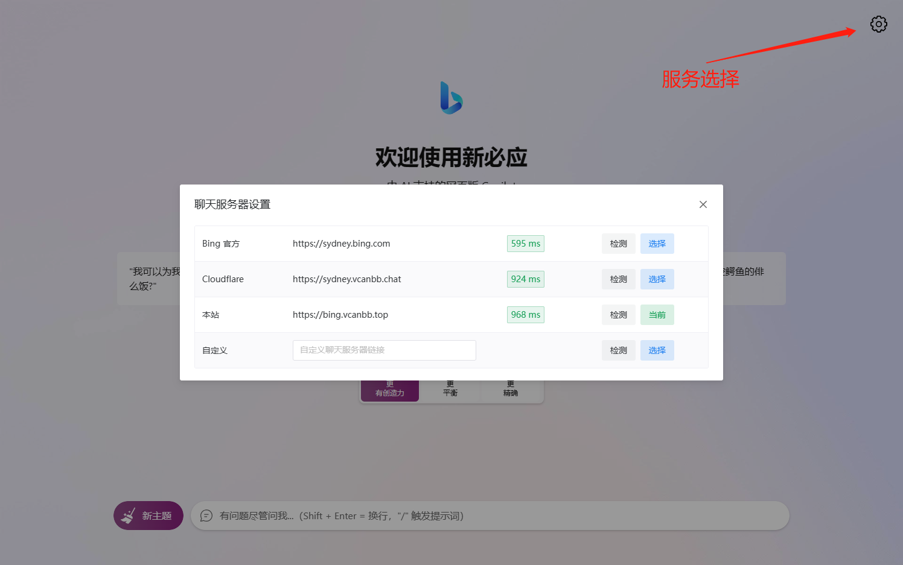

- 电脑端画图

> ⭐ 需登录，并选择 更有创造力 对话模式


- 手机端未登录状态


## 侧边栏

- 在 Edge 浏览器可把聊天和撰写分别添加侧边栏

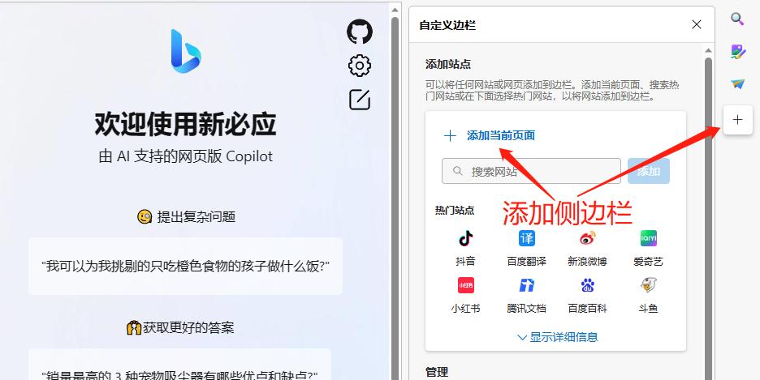


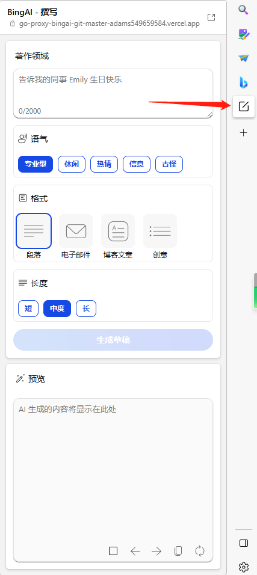

## 演示站点

### 甲骨文小鸡仔，轻虐

- https://bing.vcanbb.top

### Railway 搭建

- https://bing-railway.vcanbb.top

- https://go-proxy-bingai-production.up.railway.app

### Vercel 搭建

- https://bing-vercel.vcanbb.top

- https://go-proxy-bingai-adams549659584.vercel.app

### Render 搭建

- https://bing-render.vcanbb.top

- https://go-proxy-bingai.onrender.com

## 设置用户

- 访问 https://www.bing.com/ 或 https://cn.bing.com/ ，登录

- F12 或 Ctrl + Shift + I 打开控制台

- 拿到 Cookie 中 _U 的值 后，在网站设置 => 设置用户 中填入即可。

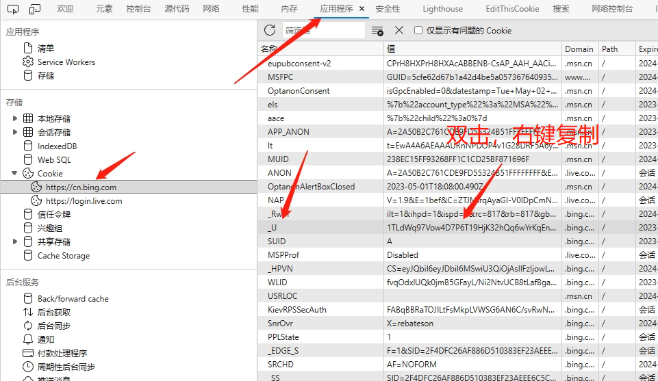

## 环境变量

```bash
# 运行端口 默认 8080 可选
PORT=8080
# Socks 环境变量 示例 可选
Go_Proxy_BingAI_SOCKS_URL=192.168.0.88:1070
# Socks 账号、密码 可选
Go_Proxy_BingAI_SOCKS_USER=xxx
Go_Proxy_BingAI_SOCKS_PWD=xxx
# 默认用户 Cookie 设置，可选，不推荐使用，固定前缀 Go_Proxy_BingAI_USER_TOKEN 可设置多个，未登录用户将随机使用，多人共用将很快触发图形验证，并很快达到该账号的24小时限制
Go_Proxy_BingAI_USER_TOKEN_1=xxx
Go_Proxy_BingAI_USER_TOKEN_2=xxx
Go_Proxy_BingAI_USER_TOKEN_3=xxx ...
# 简单授权认证密码，可选
Go_Proxy_BingAI_AUTH_KEY=xxx
```

## 部署

> ⭐ 需 https 域名 (自行配置 nginx 等) (前后端都有限制 只有在HTTPS的情况下，浏览器 Accept-Encoding 才会包含 br , localhost 除外)

> 支持 Linux (amd64 / arm64)、Windows (amd64 / arm64)

> 国内机器部署可配置 socks 环境变量

### Docker

> 参考 [Dockerfile](./docker/Dockerfile) 、[docker-compose.yml](./docker/docker-compose.yml)

- docker 示例

```bash
# 运行容器 监听8080 端口
docker run -d -p 8080:8080 --name go-proxy-bingai --restart=unless-stopped adams549659584/go-proxy-bingai

# 配置 socks 环境变量
docker run -e Go_Proxy_BingAI_SOCKS_URL=192.168.0.88:1070 -e Go_Proxy_BingAI_SOCKS_USER=xxx -e Go_Proxy_BingAI_SOCKS_PWD=xxx -d -p 8080:8080 --name go-proxy-bingai --restart=unless-stopped adams549659584/go-proxy-bingai
```

- docker compose 示例

```yaml
version: '3'

services:
  go-proxy-bingai:
    # 镜像名称
    image: adams549659584/go-proxy-bingai
    # 容器名称
    container_name: go-proxy-bingai  
    # 自启动
    restart: unless-stopped
    ports:
      - 8080:8080
    # environment:
    #   - Go_Proxy_BingAI_SOCKS_URL=192.168.0.88:1070
    #   - Go_Proxy_BingAI_SOCKS_USER=xxx
    #   - Go_Proxy_BingAI_SOCKS_PWD=xxx
    #   - Go_Proxy_BingAI_USER_TOKEN_1=xxx
    #   - Go_Proxy_BingAI_USER_TOKEN_2=xxx    
```

### Release

在 [GitHub Releases](https://github.com/adams549659584/go-proxy-bingai/releases) 下载适用于对应平台的压缩包，解压后可得到可执行文件 go-proxy-bingai，直接运行即可。

### Railway

> 主要配置 Dockerfile 路径 及 端口就可以

```bash
PORT=8080
RAILWAY_DOCKERFILE_PATH=docker/Dockerfile
```

一键部署，点这里 => [](https://railway.app/template/uIckWS?referralCode=BBs747)

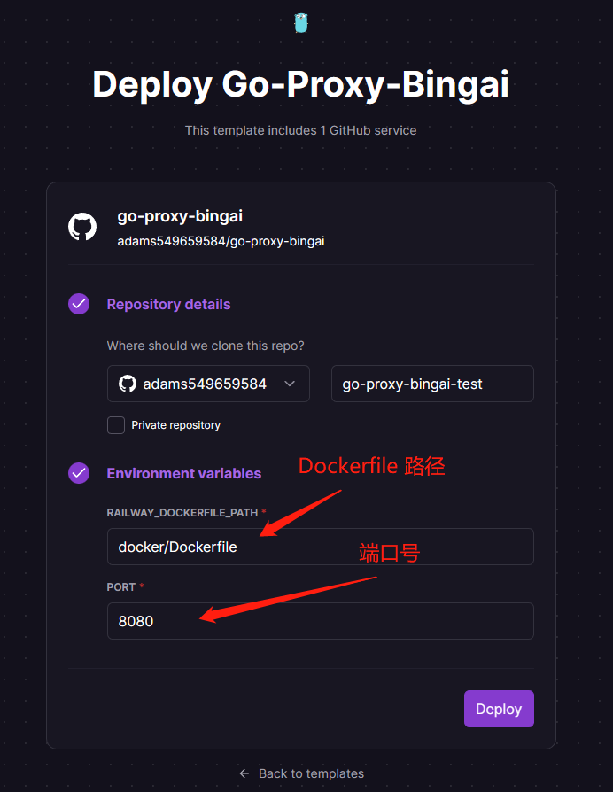

自行使用 Railway 部署配置如下

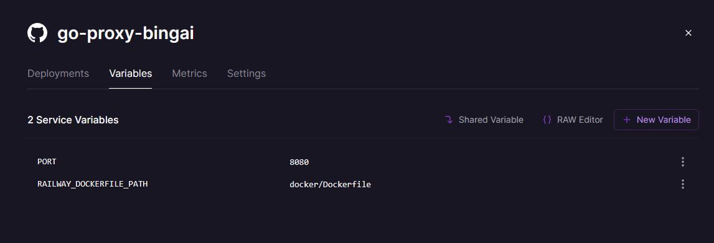

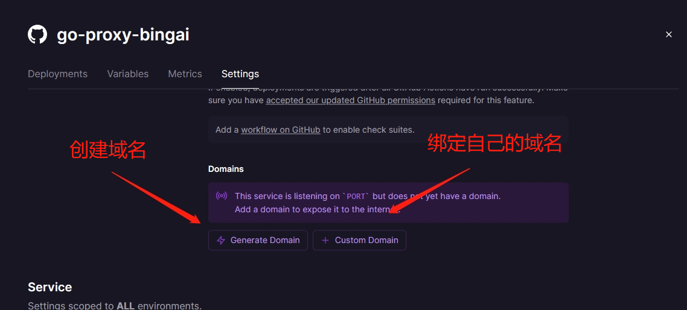

### Vercel

> ⭐ Vercel 部署不支持 Websocket ，需选择 官方聊天服务器 或 Cloudflare

一键部署，点这里 => [](https://vercel.com/new/clone?repository-url=https://github.com/adams549659584/go-proxy-bingai&project-name=go-proxy-bingai&repository-name=go-proxy-bingai-vercel)

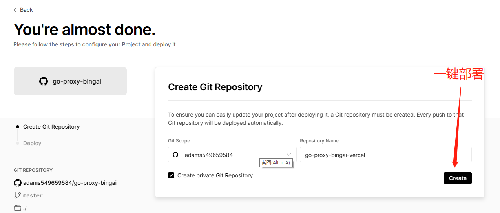

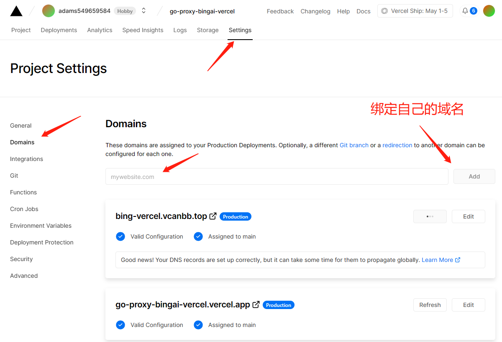

### Render

一键部署，点这里 => [](https://render.com/deploy?repo=https://github.com/adams549659584/go-proxy-bingai)

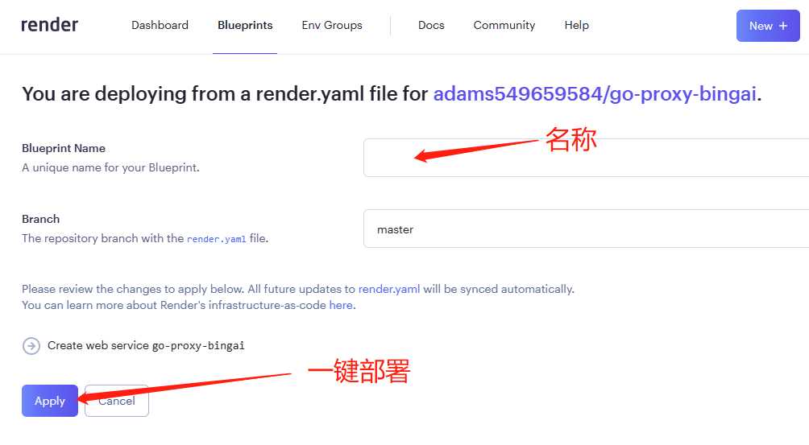

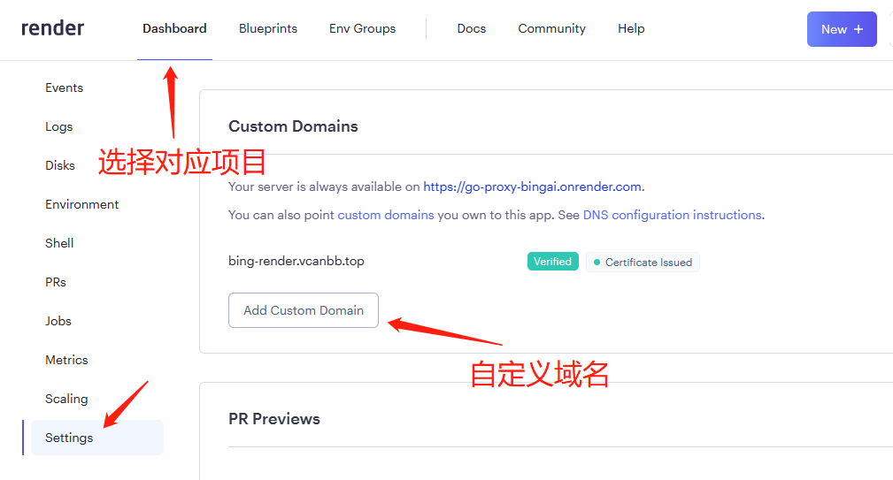

## 部署聊天服务器

> 核心代码 [worker.js](./cloudflare/worker.js)

> 具体部署 Cloudflare Workers 教程自行查询，大概如下

- [注册 Cloudflare 账号](https://dash.cloudflare.com/sign-up)

- 创建 Worker 服务，复制 [worker.js](./cloudflare/worker.js) 全部代码，粘贴至创建的服务中，保存并部署。

- 触发器 中自定义访问域名。

## TODO

- [x] 撰写
- [x] Vue3 重构
- [x] 提示词
- [x] 历史聊天
- [x] 导出消息到本地（Markdown、图片、PDF）
- [x] 简单访问权限控制
